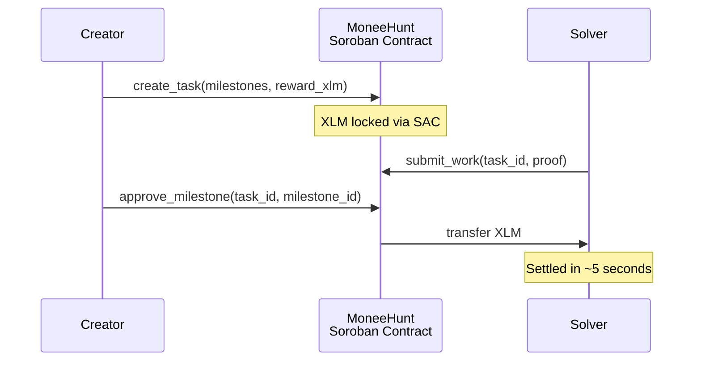
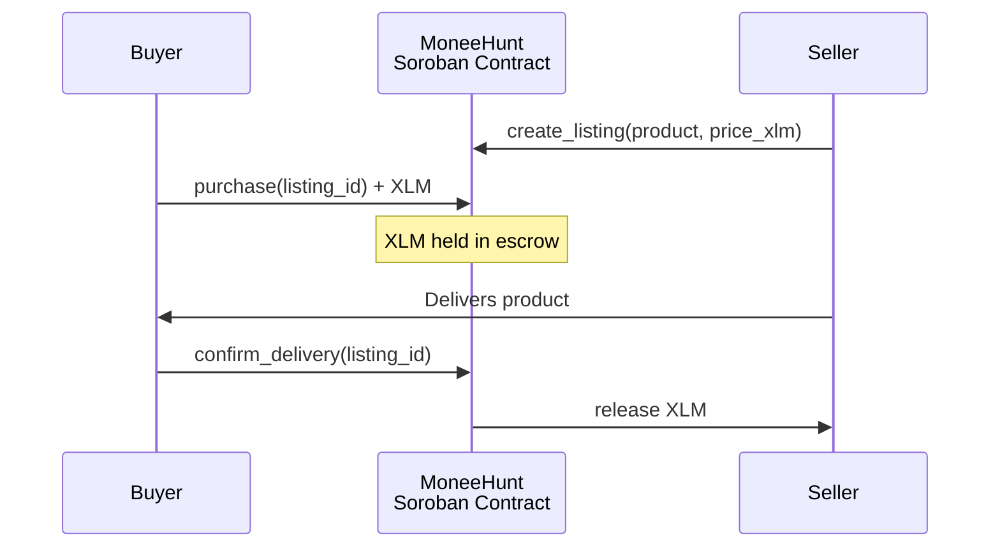
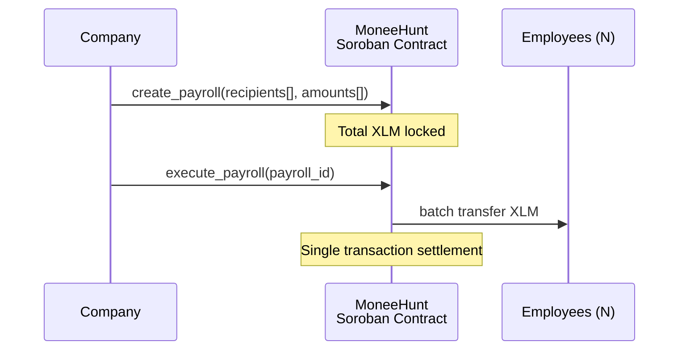

<div align="center">


# MoneeHunt

**Trustless Escrow Infrastructure for the Stellar Economy**

Commerce. Bounties. Payroll. All on-chain. All trustless.

**Built on Stellar · Powered by Soroban · Settled in XLM**

</div>

---

## What is MoneeHunt?

MoneeHunt is escrow infrastructure for the Stellar network. It replaces trust-based agreements with programmable, self-enforcing smart contracts on Soroban — Stellar's native smart contract platform.

Funds are locked in XLM. Conditions are defined upfront. Settlement is automatic. No middlemen, no disputes, no delays.

**One platform. Three verticals. Billions in addressable transactions.**

---

## The Opportunity

Every day, millions of transactions stall because neither party trusts the other:

> *"What if I pay and they never deliver?"*
> *"What if I deliver and they never pay?"*
> *"What if I finish the work and the client disappears?"*

Traditional escrow is slow, expensive, and centralized. Crypto escrow on most L1s is cheap but clunky — requiring token wrapping, bridge risk, and high gas volatility.

**Stellar changes the equation.**

| Metric | Stellar | Ethereum | Solana |
|--------|---------|----------|--------|
| Finality | ~5 seconds | ~13 minutes | ~0.4 seconds |
| Transaction cost | $0.00001 | $0.50 – $50+ | $0.001 – $0.02 |
| Native token in contracts | Direct (via SAC) | Requires wrapping | Direct |
| Smart contract runtime | Soroban (Rust/Wasm) | EVM (Solidity) | SVM (Rust) |
| Built-in compliance tools | Yes | No | No |
| Integrated DEX | Yes | No | No |

Stellar gives MoneeHunt sub-cent transaction costs, 5-second finality, native XLM access inside contracts, and built-in regulatory tooling — the ideal foundation for real-world commerce infrastructure.

---

## Core Verticals

### 1. Task Rewards & Milestone Escrow

Project creators post bounties. Solvers claim tasks. XLM is locked in escrow and released milestone-by-milestone as work is verified.

**Use cases:** open-source bounties, freelance contracts, hackathon prizes, grant disbursements.

### 2. Peer-to-Peer Product Sales

Sellers generate escrow-protected checkout links. Buyers deposit XLM. Funds are held until delivery is confirmed — then released automatically.

**Use cases:** digital goods, physical merchandise, service agreements, cross-border trade.

### 3. Corporate Payroll (MoneeHunt for Teams)

Companies upload CSV payrolls and disburse XLM salaries to hundreds of employees in a single batched transaction — with significant gas savings over individual transfers.

**Use cases:** remote team payroll, contractor payments, recurring stipends, DAO contributor compensation.

---

## Why Stellar?

MoneeHunt is built exclusively on Stellar because no other chain offers this combination:

**Native XLM in smart contracts.** Stellar's Asset Contract (SAC) provides a built-in interface that exposes XLM directly to Soroban contracts — no synthetic wrapper tokens, no bridging, no ERC-20 proxies. Users deposit XLM and receive XLM. Same token, same ledger, zero fragmentation.

**Sub-cent fees at scale.** Escrow operations (create, fund, release, refund) cost fractions of a cent. This makes micro-escrows viable — a $5 freelance bounty isn't eaten by gas fees.

**5-second finality.** Sellers see confirmed funds in seconds. Buyers see confirmed releases in seconds. No waiting 12+ blocks for settlement confidence.

**Built-in compliance.** Stellar's asset controls (clawback, authorization flags, regulated assets) make MoneeHunt ready for enterprise and institutional adoption without bolting on third-party compliance layers.

**State archival.** Soroban uses a TTL-based storage model — contract data has a defined lifespan and is archived from the live ledger when its rent expires. Settled escrows are cleaned up automatically, keeping the network lean without unbounded state growth.

```
                 BUYER / CREATOR
                        │
                    100 XLM
                        │
                        ↓
             ┌─────────────────────┐
             │      MoneeHunt      │
             │  Soroban Contract   │
             │   100 XLM held     │
             │    (via SAC)       │
             └──────────┬──────────┘
                        │
                   Conditions
                    satisfied
                        │
                        ↓
                 SELLER / SOLVER
                    100 XLM
```

The seller knows the money exists. The buyer knows it can't be claimed without delivery. The contract enforces both sides.

---

## Architecture

```
moneehunt/
├── contracts/                    # Soroban smart contracts (Rust)
│   ├── milestone-escrow/         # Pillar 1 — Task rewards
│   ├── product-escrow/           # Pillar 2 — Product sales
│   └── batch-payroll/            # Pillar 3 — Team payroll
├── frontend/                     # Next.js (App Router)
│   ├── app/                      # Pages & routing
│   ├── components/               # UI components
│   └── lib/                      # Stellar SDK helpers
└── docs/                         # Specifications
```

### Technical Stack

| Layer | Technology |
|-------|-----------|
| Smart Contracts | Rust → Wasm on Soroban |
| Escrow Settlement | XLM (native, via Stellar Asset Contract) |
| Wallet | Freighter / Stellar Wallets Kit |
| Frontend | Next.js (App Router) |
| Contract SDK | `soroban-sdk` |
| Client SDK | `@stellar/stellar-sdk`, `@stellar/freighter-api` |
| Social Layer | Farcaster Frame v2 (`@farcaster/frame-sdk`) |
| CLI | `stellar-cli` |

---

## Escrow Lifecycle

### Task Rewards



### Product Sales



### Batch Payroll



---

## Farcaster Integration

MoneeHunt ships as a native **Farcaster Frame v2** mini app:

- **In-feed transactions** — buy, fund, or claim directly from the Warpcast timeline
- **Frame-native checkout** — no external redirects
- **Launcher pinning** — persistent access from the Warpcast app drawer
- **Freighter signing** — transaction approval via wallet injection

See the integration guide for technical details.

---

## Getting Started

### Prerequisites

- [Rust](https://rustup.rs/) (latest stable)
- [Stellar CLI](https://developers.stellar.org/docs/build/smart-contracts/getting-started) — `cargo install --locked stellar-cli`
- [Node.js](https://nodejs.org/) v18+
- [Freighter Wallet](https://freighter.app/)

### Build & Deploy

```bash
# Clone
git clone https://github.com/nodeblocteam/moneehunt.git
cd moneehunt

# Build contracts
cd contracts/milestone-escrow && stellar contract build
cd ../product-escrow && stellar contract build
cd ../batch-payroll && stellar contract build

# Fund testnet account
curl "https://friendbot.stellar.org/?addr=YOUR_PUBLIC_KEY"

# Deploy
stellar contract deploy \
  --wasm target/wasm32-unknown-unknown/release/milestone_escrow.wasm \
  --network testnet \
  --source YOUR_SECRET_KEY
```

### Run Frontend

```bash
cd frontend
npm install
npm run dev
```

### Run Tests

```bash
cd contracts/milestone-escrow
cargo test
```

---

## Contributing

1. Fork the repository
2. Create a feature branch (`git checkout -b feature/your-feature`)
3. Commit changes (`git commit -m 'Add your feature'`)
4. Push to branch (`git push origin feature/your-feature`)
5. Open a Pull Request

---

## License

[MIT](LICENSE)

---

<div align="center">

**MoneeHunt — Trustless commerce infrastructure for the Stellar economy.**

</div>
